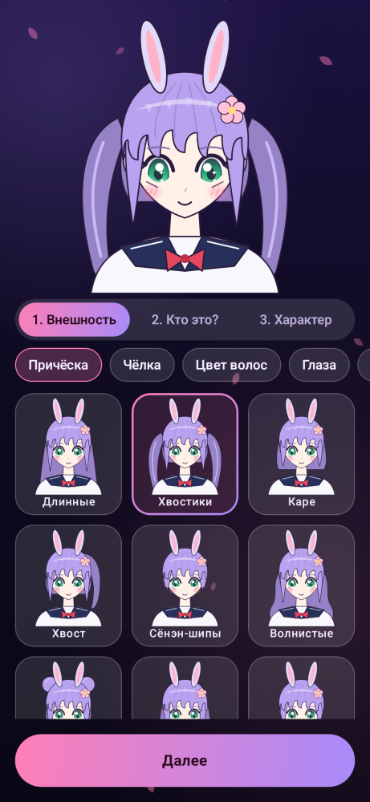
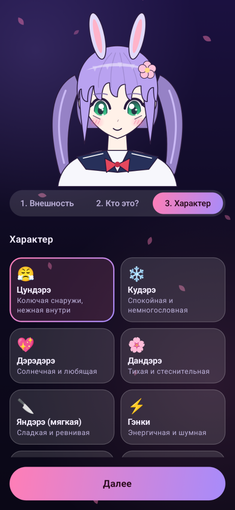
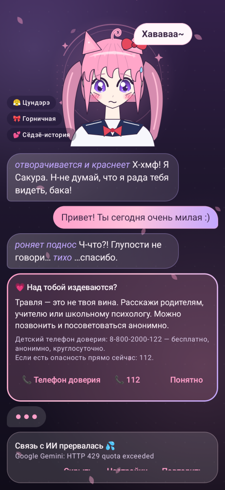
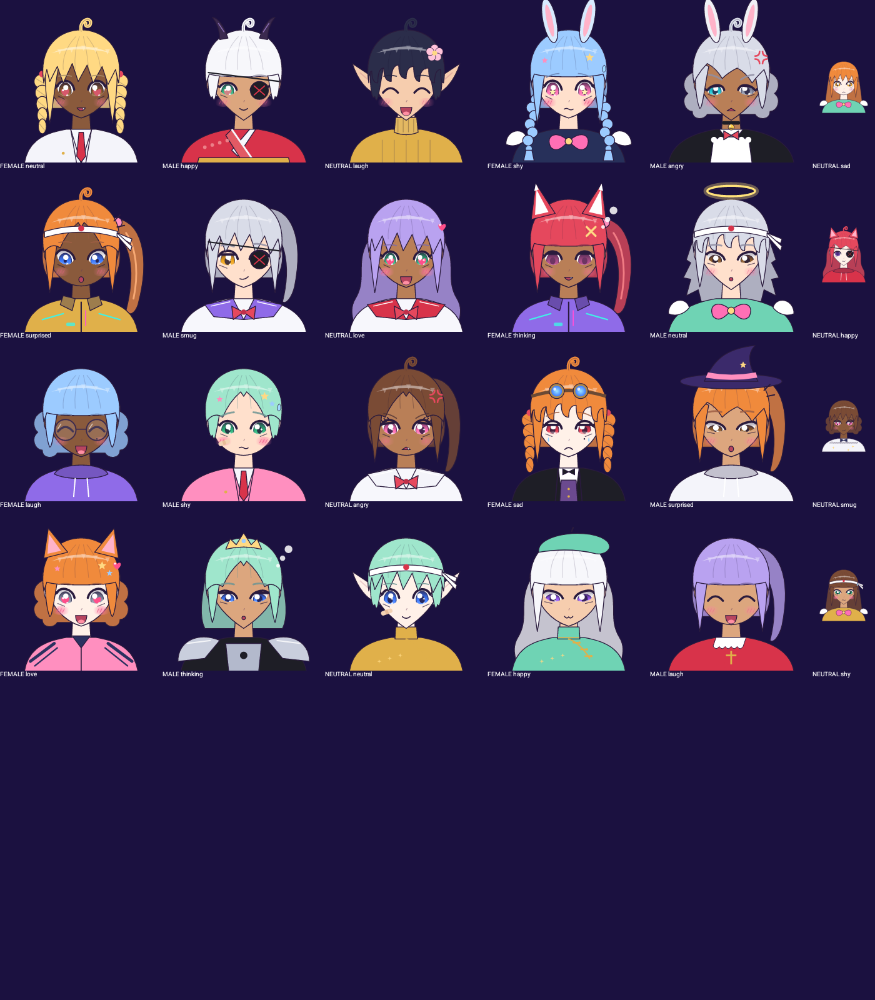
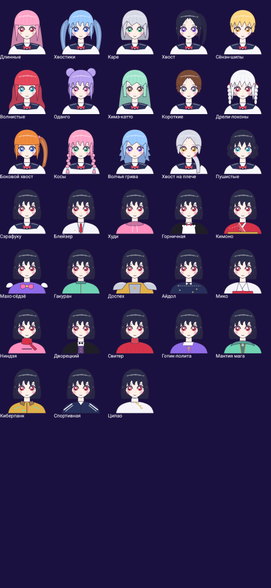
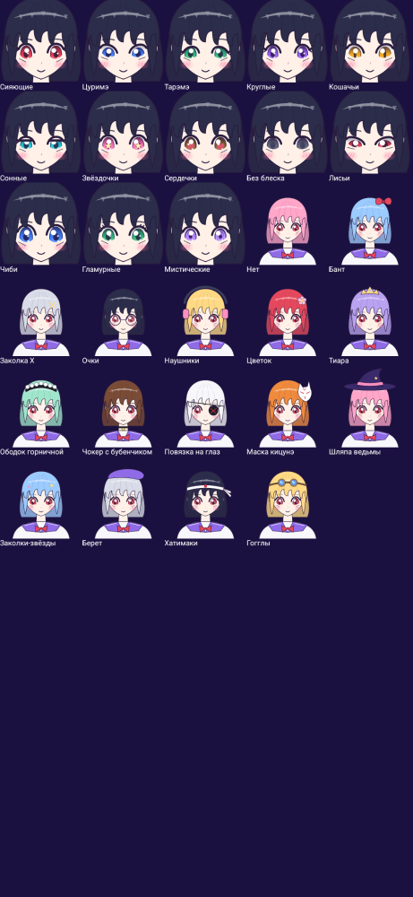

# AniMate — аниме-компаньоны для Android

Собери аниме-персонажа из классических «штампов» внешности, дай ему пол, имя, характер, профессию и направление общения — и болтай с ним в чате. Персонаж отвечает через бесплатные LLM API, помнит историю, меняет выражение лица по эмоциям и издаёт шаблонные аниме-звуки («ня~», «кья!», «бака!»). На фоне играет генеративный лофай.

| Конструктор | Характер | Чат |
|---|---|---|
|  |  |  |



<details><summary>Все причёски, наряды, глаза и аксессуары</summary>





</details>

## Возможности

- **Конструктор внешности** — 13 категорий пресетов с живым превью каждого варианта: 15 причёсок (хвостики, химэ-катто, оданго, дрели-локоны, косы, боковой хвост, волчья грива, сёнэн-шипы…), чёлка, цвет волос, 13 стилей глаз (сёдзё-блеск, цуримэ, тарэмэ, кошачьи, звёздочки, сердечки, без блеска, чиби, мистические…), рот, лицо, кожа, ушки (нэко, кицунэ, зайка, эльф, рожки, нимб), 16 аксессуаров (бант, очки, шляпа ведьмы, маска кицунэ, повязка на глаз, чокер с бубенчиком, гогглы…), 18 нарядов (сэрафуку, горничная, кимоно, махо-сёдзё, айдол, мико, ниндзя, дворецкий, готик-лолита, мантия мага, киберпанк, ципао…), особенности (ахогэ, клычок, гетерохромия…). Кнопка 🎲 — случайный персонаж.
- **Пол и имя** — генератор японских имён в стиле аниме (девушка / парень / андрогин) + свободное описание.
- **Характер** — 10 архетипов (цундэрэ, кудэрэ, дандэрэ, мягкая яндэрэ, гэнки, химэдэрэ, тюнибё…), 18 профессий/ролей, 9 направлений общения (романтика, приключение, повседневность, учим японский…).
- **Чат** — эмоции `[emo:…]` из ответа меняют лицо персонажа (10 выражений), моргание, дыхание, анимация рта; *действия* в звёздочках подсвечиваются; перегенерация, копирование, удаление сообщений.
- **Память** — история в Room; старые сообщения автоматически сжимаются в «память персонажа», которую можно посмотреть и поправить. Растёт уровень близости ❤.
- **Звук** — 3 процедурных лофай-трека (Rhodes, бас, свинг-барабаны, винил, дождь), синтезированные голосовые возгласы под пол/характер персонажа, UI-звуки. Никаких аудиофайлов и лицензий.

## Безопасность

Персонажи общаются с учётом того, что собеседник может быть ребёнком: неизменяемые правила безопасности в системном промпте, карточка помощи с телефоном доверия при тревожных сообщениях, напоминания о сне и перерывах, память без личных данных. Подробно — [docs/SAFETY.md](docs/SAFETY.md).

## ИИ-провайдеры

Все провайдеры — OpenAI-совместимые, переключение в настройках. При ошибке/лимите приложение само пробует следующий провайдер с ключом.

| Провайдер | Бесплатно | Где взять ключ |
|---|---|---|
| **Google Gemini** (по умолчанию) | ~1500 запросов/день, лучший русский | https://aistudio.google.com/apikey |
| Groq | ~30 запросов/мин, очень быстро | https://console.groq.com/keys |
| OpenRouter | модели `:free`, ~50 запросов/день | https://openrouter.ai/keys |
| Pollinations | бесплатный ключ; без ключа — почти не работает | https://enter.pollinations.ai |
| xAI Grok | платный | https://console.x.ai |

Ключи хранятся только на устройстве (DataStore) и исключены из бэкапов. Модель можно выбрать из списка (`/models`) и проверить кнопкой «Проверить».

## Сборка

Требуется JDK 17+ и Android SDK (platform 35).

```bash
./gradlew :app:assembleDebug        # app/build/outputs/apk/debug/app-debug.apk
./gradlew :app:testDebugUnitTest    # юнит-тесты + снапшоты Paparazzi
./gradlew :app:recordPaparazziDebug # перерисовать скриншоты в app/src/test/snapshots
```

GitHub Actions собирает debug- и release-APK на каждый push (артефакт `animate-apk`).

### Релизы

Релиз публикуется workflow **Release**: запустите его вручную (Actions → Release → Run workflow, версия вида `1.0.0`) или запушьте тег `v1.0.0`. Он прогоняет тесты, собирает APK и создаёт GitHub Release с файлом `AniMate-vX.Y.Z.apk`.

Чтобы обновления ставились поверх старой версии, APK должен подписываться одним и тем же ключом. Создайте ключ и добавьте секреты репозитория:

```bash
keytool -genkeypair -keystore animate.jks -alias animate -keyalg RSA -keysize 2048 -validity 10000
base64 -w0 animate.jks   # → секрет ANIMATE_KEYSTORE_BASE64
```

Секреты: `ANIMATE_KEYSTORE_BASE64`, `ANIMATE_KEYSTORE_PASSWORD`, `ANIMATE_KEY_ALIAS`, `ANIMATE_KEY_PASSWORD`. Без них релиз подписывается одноразовым debug-ключом.

## Архитектура

```
app/src/main/java/com/animate/companion/
├── model/      Appearance, пресеты внешности и личности, генератор имён
├── data/       Room (персонажи, сообщения), DataStore-настройки
├── llm/        OpenAI-совместимый клиент, сборка промпта, память, цепочка провайдеров
├── audio/      LofiComposer/LofiPlayer, формантный VoiceSynth, Sfx, SoundDirector
└── ui/         Compose: avatar (векторная отрисовка), home, create, chat, settings
```

Kotlin, Jetpack Compose (Material 3), Room, DataStore, OkHttp, kotlinx.serialization. Без DI-фреймворка — простой `AppContainer`.
