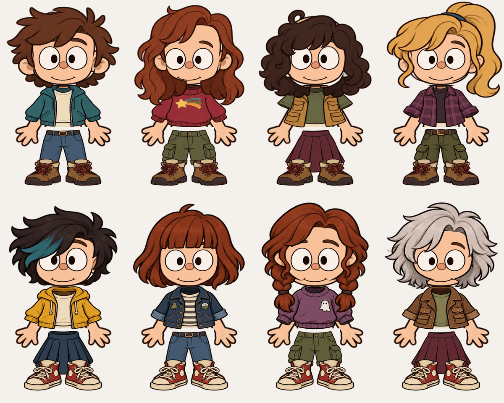

# Лесные приключения: персонажи, иконка и музыка

Старые аниме-иллюстрации и процедурный конструктор убраны из интерфейса. AvatarView всегда использует CartoonAvatar. Создание персонажа сразу открывает новые настройки. Сохранённые карточки, чаты и исходный JSON остаются на месте; старые ID получают стабильные новые образы через Appearance.resolvedCartoonLook().

32 прозрачных PNG: 8 причёсок, 8 вариантов верха, 5 низов, 2 пары обуви, лицо, 2 пары глаз, 2 рта и 3 аксессуара. Новые детали: бирюзовая прядь, рыжее каре, косы, серебристые волосы, худи, джинсовая куртка, свитшот с призраком, пальто, походные брюки, синяя юбка, кеды и шапка. Очки сочетаются с кепкой и шапкой. Индексы прежних деталей сохранены; новые добавлены в конец.

Иконка — нарисованный фонарь со светящимся духом в ночном лесу. Подключена через adaptive icon. Для системных тематических значков используется оригинальный силуэт фонаря.

Три новые оригинальные процедурные мелодии: «Тропа к загадкам» (96 BPM), «Чердачный дневник» (82 BPM), «Летний лагерь» (94 BPM). Флейта, щипковые струны, колокольчики и деревянная перкуссия. Каждая композиция имеет собственную 32-шаговую мелодию и гармонию. Записи и мелодии сериала не используются. Индексы музыкальных настроек, громкость, плавное появление, пауза в фоне и приглушение при речи сохраняются.

Проверка: прозрачность и границы всех 32 PNG; просмотр сборки; Android CI для сохранения, совместимости старых ID, новых деталей, аудиосинтеза/длительности/слышимости, Paparazzi и debug/release APK.

## Создание графики

Встроенный imagegen. Новые PNG: `app/src/main/assets/cartoon/21_...`—`32_...`; координаты: `app/src/main/assets/cartoon_layers.json`; иконка: `app/src/main/res/drawable-nodpi/launcher_forest.png`. Атлас технически разделён по альфа-компонентам без изменения рисовки. Иконка уменьшена до 512×512 и сжата с палитрой. Точные промпты:

### Детали

Use case: stylized-concept. Asset type: ONE transparent PNG atlas of twelve NEW modular dress-up character parts for an Android cartoon editor. Reference image is ONLY a visual style reference: keep its warm Gravity Falls-inspired adventurous cartoon ink and painted shading, not its assembled characters. Draw a 4-column by 3-row grid, every part separated by generous completely transparent gutters. NO text, labels, panels, numbers or characters. Exact order LEFT TO RIGHT: ROW 1 four detached hairstyles: 1 black side-swept short haircut with a teal dyed streak, 2 auburn chin-length bob with straight bangs, 3 red twin braids hanging beside a large transparent face opening, 4 shaggy silver-white medium haircut. All hairstyle centers have empty face openings, NO faces, NO ears, NO skin-colored pieces or necks; rounded big-head shape compatible with reference. ROW 2 four detached torso clothes: 1 mustard yellow zip hoodie over cream tee, 2 navy denim jacket with small nature patches over striped tee, 3 purple cozy sweatshirt with a tiny original white ghost patch, 4 brown explorer coat with pocket flaps over pale green shirt. Each is a separate front-facing short child-proportioned torso garment with empty neck hole and wide shoulder sleeves, stopping at waist; NO skin, arms, hands, head or trousers. ROW 3: 1 dark olive rolled-up hiking trousers, front facing pair legs with belt waistband; 2 dark blue pleated skirt with broad waistband; 3 a matched pair of chunky red-and-cream canvas sneakers with black cartoon outlines, front/three-quarter symmetric view; 4 a red knitted beanie with pom-pom, isolated hat. Exactly twelve complete assets, fully visible, centered in equally sized cells. Not schematic: lively hand-drawn contours, thick dark brown ink, subtly textured shaded warm flat colors, charming outdoor-cartoon detail. True alpha transparency everywhere outside the twelve shapes, including inside face openings and empty space between trouser legs/shoes. No shadows behind assets. Prioritize consistent visual fidelity and clean separation for cropping.

### Иконка

Use case: logo-brand. Asset type: final square Android launcher icon for a mystery forest cartoon companion app. Draw a polished hand-inked warm adventure cartoon icon inspired by the visual atmosphere of Gravity Falls, original artwork and original symbol. Full opaque square background, dark muted teal forest at night with two simple silhouetted pines at the sides and one tiny crescent. CENTRAL SYMBOL: one charming large vintage explorer lantern, amber glass glowing inside, red-brown frame, stout rounded shape, carrying a simple playful two-dot-eyed friendly light spirit. Thick expressive dark brown hand-drawn outlines, restrained painted cel shading, amber gold versus deep forest green, tiny spark. Composition: strong instantly recognizable single lantern in the CENTER, all essential lantern parts entirely within the central 60 percent of the square; generous dark background border on every side for Android circular/adaptive masking. Keep the design very readable at 48 px. No writing, no letters, no logos, no watermarks, no mockup, no border frame, no corner rounding; no existing TV-show character or emblem.

