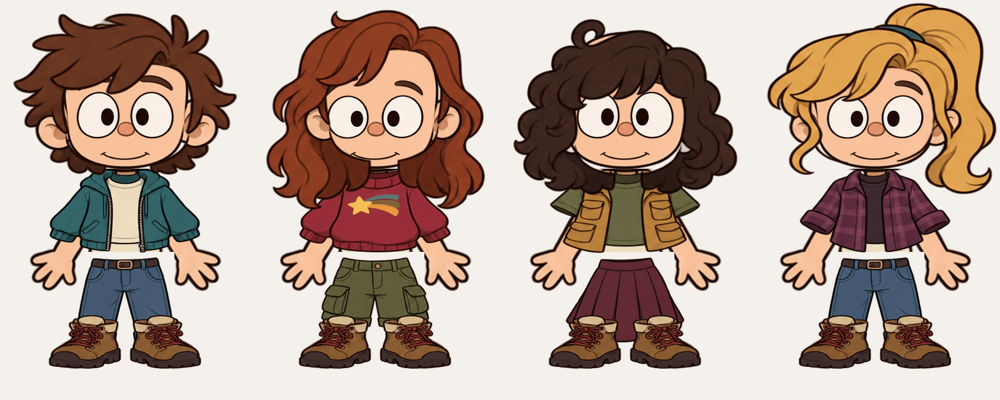

# Нарисованные персонажи: «Лесные приключения»

Новый персонаж начинает с этого стиля. Для существующего героя выберите его в галерее, затем откройте «Студию образа → Детали». Настройки волос, лица, глаз, рта, верха, низа, обуви и аксессуаров независимы. Кнопка случайного образа выбирает сочетание внутри этого набора. Сохранение и повторное открытие сохраняют выбранные детали; отмена закрывает черновик.

## Устройство

20 оригинальных прозрачных PNG находятся в `app/src/main/assets/cartoon/`. Это нарисованные растровые детали мультяшного героя в духе лесных приключений, а не процедурная векторная замена. Их координаты и масштаб на холсте 400×640 задаёт `cartoon_layers.json`. Волосяные пряди, брови, нос и одежда сохраняют исходную рисовку. Лицо имеет три близких варианта пропорций из одной базовой детали.

`CartoonAvatar` собирает тело, низ, обувь, верх, лицо, глаза, рот, волосы и аксессуары в указанном порядке. Голова базового тела отсекается через `sourceY`; техническая нижняя одежда тела скрывается маской под выбранной одеждой. Изображения декодируются один раз. PNG хранятся как assets и не удаляются Android resource shrinker в release APK.

`Appearance.cartoonLook` хранит настройки с новым стабильным ID `woodland`. Старые иллюстрации и данные внешности продолжают открываться своими прежними рендерами. Сохранение студии использует существующую проверку совпадения ID, чтобы старый черновик не перезаписал выбранный позже образ. Описание внешности для чат-модели соответствует выбранной причёске, одежде и аксессуарам.

Существующие кадрирование, отражение, поворот и цветовые настройки применяются ко всей сборке. Есть дыхание, моргание и переключение двух кадров рта при речи. Переключатель движения отключает анимацию. Этот первый набор содержит две нарисованные пары глаз и два рта; отдельные рисунки для всех эмоций чата пока отсутствуют.

## Проверка

- `./gradlew :app:testDebugUnitTest`: сохранение, совместимость прежнего JSON, конфликт черновиков и нормализация индексов.
- `./gradlew :app:recordPaparazziDebug`: разные причёски, лица, одежда, аксессуары, портрет, полный рост, миниатюры, закрытые глаза и открытый рот.
- `./gradlew :app:assembleDebug :app:assembleRelease`: обе версии APK.
- `npm install --no-save sharp && node tools/preview_cartoon.cjs`: воспроизводимый технический превью-монтаж по тем же координатам.
