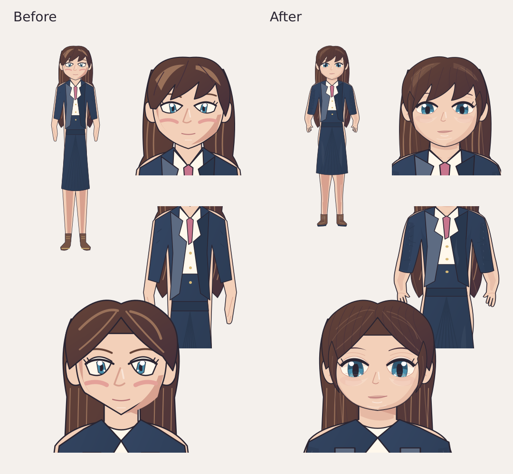

# Illustrated characters

Three offline full-height cutouts derived from the user-supplied character references: classic anime, modern manga, and adventure cartoon. Generated with the built-in imagegen tool; packed as 1024×1536 WebP assets with the original alpha in `app/src/main/res/drawable-nodpi/character_*.webp`. No network dependency.

Prompt set (one call per supplied style/identity): Preserve the reference person, face, hair, age, clothing and art style. Draw one complete full-height standing character, frontal three-quarter pose, friendly neutral expression, detailed hair strands, face shading, garment folds and accessories. Center on a genuinely transparent portrait canvas, keep the whole silhouette, no duplicate portrait, panels, text or floor. No chibi simplification.

`Appearance.illustrationId` is optional. Missing/unknown IDs keep the existing procedural renderer; legacy characters are not silently replaced. New creator sessions start with classic illustrated art. The chat menu lets users select artwork or restore their original custom appearance. Atomic DAO writes update only appearance JSON, preserving concurrently updated memory and message metadata.

Illustrated art has a fixed face and costume, with gentle breathing movement; it does not implement lip sync or facial emotion replacement. The existing procedural constructor retains those capabilities. LLM appearance descriptions follow the displayed illustration rather than the hidden customizable parameters.

Portrait, full-height and thumbnail crops are drawn from the same packaged image. Only the compositing bounds change; there are no duplicate decoded portrait resources. Preview tests cover all three artwork IDs, full-height silhouettes, bust crops, and 44/72dp avatars on a light background.

## Editor: first stage

The illustration editor is available in the creation studio and the chat menu.
It keeps a private, rotation-safe draft until Save; Cancel leaves the stored appearance unchanged.
Settings include framing (zoom and horizontal/vertical position), mirroring, saturation,
warmth and idle motion. Reset restores the original presentation. These controls apply
consistently to portrait, full-body and thumbnail rendering and never modify source assets.
Save updates appearance only, retaining chat history, memory and the procedural avatar.
Older appearance JSON receives neutral defaults. Numeric controls are bounded before rendering.

This is a presentation editor, not yet a layered character constructor. Hair, face,
outfit and expression are part of the same bitmap. Independent editing requires registered
layers and expression variants for each character; global colour controls are explicitly labelled.

## Editable artwork revision

The constructor asset `character_layers.json` now uses curved hair locks, layered irises and eyelids, softer face shading, anatomically separated fingers, curved blazer sleeves, fabric folds and stitched boots. All 14 hairstyles and 12 outfits remain independent and retain their saved IDs. Original flattened character artwork remains available in the gallery.

Path records support `sy` (default 1) and `opacity` (default 1). Body, outfit and shoes share the same anchored transform so their seams stay aligned. The full-body viewport follows the new proportions; thumbnails include wide hairstyles. Blinking uses a registered curved eyelid layer rather than two straight lines.

`python tools/preview_character.py --output /tmp/characters.svg` validates layer keys, palette references and transforms, then produces a review sheet. This is an SVG approximation of the Android renderer, not an Android screenshot. Local review rendered all 168 hair/outfit combinations with an SVG engine. Android unit tests, Paparazzi previews and APK builds are checked by the repository's Android workflow.

